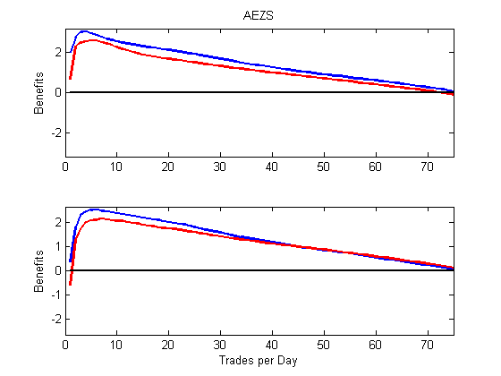

[](http://quantlet.de/)

## [](http://quantlet.de/) **VFARbenefitPlot** [](http://quantlet.de/)

```yaml

Name of Quantlet : VFARbenefitPlot

Published in : Unpublished; VFAR

Description : 'Plot benefit of strategic placement of orders according to VFAR predictions over equal-splitting strategy'

Keywords : 'LOB, VFAR, order execution'

See also : 'VFARmapePlot, VFARrandVfarPlot, VFARrandhStepForecastPlot, VFARqqPlot'

Author : Ying Chen, Wee Song Chua, Wolfgang Karl Haerdle

Submitted : Sat, Mar 11 2017 by Wee Song Chua

Datafile : AEZSbenefit.mat

Example: 
- Plot : "Benefit of VFAR-implied strategy over equal-splitting strategy"


```




### MATLAB Code:
```matlab
%% Plot benefit of strategic placement of orders according to VFAR 
% predictions over equal-splitting strategy

% load relevant data
load('AEZSbenefit.mat')

% benefit plot with various liquidity demand
figure
for zz=1:length(LIQ)
    % set y limit
    lowYlim = min( [ AVGbenBUY(:,zz); AVGbenSELL(:,zz); ...
                     -max( [AVGbenBUY(:,zz); AVGbenSELL(:,zz)] ) ] );
    lowYlim = lowYlim - 0.05*abs(lowYlim);        
    upYlim  = max( [ AVGbenBUY(:,zz); AVGbenSELL(:,zz);...
                     -min( [AVGbenBUY(:,zz); AVGbenSELL(:,zz)] ) ] );
    upYlim  = upYlim + 0.05*upYlim;
    
    % first panel, lowest liquidity demand
    if zz==1
        subplot(length(LIQ),1,zz) 
        plot(1:n,AVGbenBUY(:,zz),'b', 1:n,AVGbenSELL(:,zz),'r',[1 n],...
            [0 0],'k','LineWidth',2)
        xlim([0 n])
        ylim([lowYlim upYlim])
        title(ticker)
        ylabel('Benefits')
        
    % inbetween first and last panel for more than 2 liquidity demand cases    
    elseif zz==length(LIQ)
        subplot(length(LIQ),1,zz)
        plot(1:n,AVGbenBUY(:,zz),'b', 1:n,AVGbenSELL(:,zz),'r',[1 n],...
            [0 0],'k','LineWidth',2)
        xlim([0 n])
        ylim([lowYlim upYlim])
        hold off
        xlabel('Trades per Day') % x-axis label
        ylabel('Benefits') % y-axis label
        
    % last panel, highest liquidity demand
    else
        subplot(length(LIQ),1,zz)       % add first plot in 2 x 1 grid
        plot(1:n,AVGbenBUY(:,zz),'b', 1:n,AVGbenSELL(:,zz),'r',[1 n],...
            [0 0],'k','LineWidth',2)
        xlim([0 n])
        ylim([lowYlim upYlim])
        hold off
    end
end
 ```
