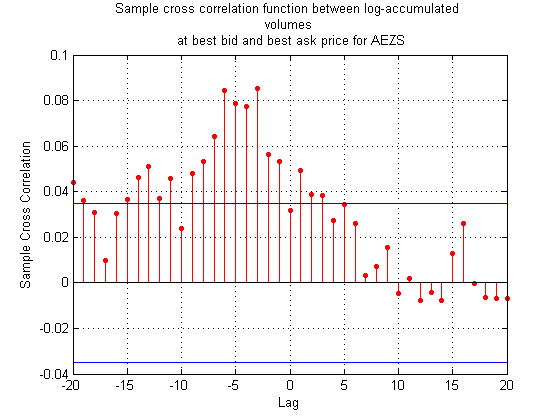

[](http://quantlet.de/)

## [](http://quantlet.de/) **VFARcrossCorrPlot** [](http://quantlet.de/)

```yaml

Name of Quantlet : VFARcrossCorrPlot

Published in : Unpublished; VFAR

Description : 'Estimates the sample cross correlation function between log-accumulated volumes at
best bid and ask price for AEZS from 2rd Jan,2015 till 6th Mar,2015.'

Keywords : plot, time-series, correlation, data visualization, visualization

See also : VFARrandBidAskCurvePlot, VFARrandVfarPlot, VFARrandhStepForecastPlot, VFARqqPlot

Author : Ying Chen, Wee Song Chua, Wolfgang Karl Haerdle

Submitted : Wed, May 18 2016 by Wee Song Chua

Datafile : AEZS.mat

Example : 'Sample cross correlation function between log-accumulated volumes at best bid and ask
price.'

```




### MATLAB Code:
```matlab
%% Plot sample cross correlation function between log-accumulated ..
% volumes at best bid and ask price

% load relevant data
load('AEZS.mat')

% declare vectors to store relevant data
lvl1VolBid       = [];
lvl1LogAccVolAsk = [];
lvl1VolBid       = [];
lvl1LogAccVolAsk = [];

for t = 1:T
    for i = 1:n
        lvl1VolAsk(i + (t - 1)*n)        = askVol_org{i + (t - 1)*n}(1);
        lvl1VolBid(i + (t - 1)*n)        = bidVol_org{i + (t - 1)*n}(1);
        lvl1LogAccVolAsk( i + (t - 1)*n) = askVol_CWS{i + (t - 1)*n}(1);
        lvl1LogAccVolBid(i + (t - 1)*n)  = bidVol_CWS{i + (t - 1)*n}(1);
    end
end

% Sample cross-correlation plot
crosscorr(lvl1LogAccVolBid, lvl1LogAccVolAsk)
title( {'Sample cross correlation function between log-accumulated ' ... 
    'volumes',char( strcat(' at best bid and best ask price for',{' '}, ...
    ticker) ) } );
```
