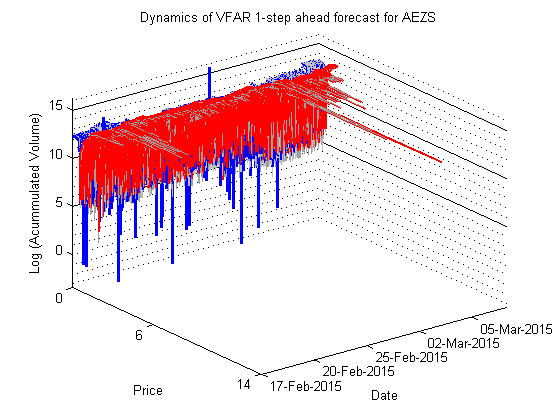

[](http://quantlet.de/index.php?p=info)

## [](http://quantlet.de/) **VFARdynamicPlot** [](http://quantlet.de/d3/ia)

```yaml

Name of Quantlet : VFARdynamicPlot

Published in : Unpublished; VFAR

Description : 'Plots dynamics of forecasted bid ask curve using VFAR approach for AEZS with LOB
data from 02Jan2015 till 06Mar2015.'

Keywords : plot, time-series, volatility, autoregressive, forecast

See also : 'VFARrandBidAskCurvePlot, VFARcrossCorrPlot, VFARrandVfarPlot, VFARqqPlot,
VFARrandhStepForecastPlot'

Author : Ying Chen, Wee Song Chua, Wolfgang Karl Haerdle

Submitted : Wed, July 13 2016 by Wee Song Chua

Datafile : AEZS.mat, 1step.mat, 5step.mat, 10step.mat

Example : dynamics of VFAR 1 step ahead forecasted bid and ask curve for AEZS

```




### MATLAB Code:
```matlab
%% Plot fitted dynamics of bid and ask curves
% load relevant data
load('AEZS.mat')

% define number of step ahead forecast h = 1, 5, or 10
h = 1;

% load relevant data
load(strcat(num2str(h),'step.mat'))

% initial training set size
initialTrainSize = 30*n; 

% last time point
endq             = n*T - 30*n - h + 1; 

% find x and y limit
lxlimit     = inf;
uxlimit     = 0;
lylimit     = inf;
uylimit     = 0;
for q = 1:endq
    lxlimit = min([lxlimit;matxb{initialTrainSize+q};
        matxa{initialTrainSize+q}]);
    uxlimit = max([uxlimit;matxb{initialTrainSize+q};
        matxa{initialTrainSize+q}]);
    lylimit = min([lylimit;bidVolhStep{q};askVolhStep{q};
        matyb{initialTrainSize+q};matya{initialTrainSize+q}]);
    uylimit = max([uylimit;bidVolhStep{q};askVolhStep{q};
        matyb{initialTrainSize+q};matya{initialTrainSize+q}]);
end

% store dates for axis
tempDate    = [2015,2,17;2015,2,18;2015,2,19;2015,2,20; ...
                2015,2,23;2015,2,24;2015,2,25;2015,2,26;2015,2,27; ...
                2015,3,2;2015,3,3;2015,3,4;2015,3,5;2015,3,6];

% get dates for axis
foreDate        = {};
for fored = 1:14
foreDate{fored} = datestr(datenum(tempDate(fored,:)));
end
dateAxisPos     = linspace(1,endq-74,14);

% adjust the dates
foreDate2           = {};
dateAxisPos2        = zeros(1,5);
for i=1:5
    foreDate2{i}    = foreDate{(i-1)*3+1};
    dateAxisPos2(i) = dateAxisPos((i-1)*3+1);
end

% adjust the dates according to number of steps for forecast
dateAxisPos3        = dateAxisPos2-h+1;
dateAxisPos3(1)     = 1;

% for loop to plot
reset(gca);
for q = 1:endq
    %actual time and date
    tpt = initialTrainSize+q+h-1; %actual time point
    
    %PLOTS
    %bid
    testxB    = matxb{tpt};
    testyB    = matyb{tpt};
    testyBhat = bidVolhStep{q};

    %ask
    testxA    = matxa{tpt};
    testyA    = matya{tpt};
    testyAhat = askVolhStep{q};
    
    %plot
    plot3(repmat(q,size(testxB)),testxB,volHatb{tpt},'color', ...
        [192 192 192]./255,'LineWidth',1);
    hold on
    plot3(repmat(q,size(testxA)),testxA,volHata{tpt},'color', ...
        [160 160 160]./255,'LineWidth',1);
    plot3(repmat(q,size(testxB)),testxB,testyBhat,'b','LineWidth',1.5);
    plot3(repmat(q,size(testxA)),testxA,testyAhat,'r','LineWidth',1.5);
end
hold off
xlabel('Date') % x-axis label
ylabel('Price') % y-axis label
zlabel('Log (Acummulated Volume)')
set(gca, 'YLim', [floor(lxlimit) ceil(uxlimit)], 'ZLim', ...
    [lylimit uylimit], 'XLim', [1 endq] ) % set  limit of axis
set(gca, 'YTick', [floor(lxlimit) floor((lxlimit+uxlimit)/2)  ...
    ceil(uxlimit)], 'YTickLabel', [floor(lxlimit); ...
    floor((lxlimit+uxlimit)/2);ceil(uxlimit)])
set(gca,'YDir','reverse') % increasing price for axis
set(gca, 'XTick', dateAxisPos3, 'XTickLabel', foreDate2')
set(gca, 'XMinorGrid', 'off','XGrid', 'off', 'YMinorGrid', ...
    'off','YGrid', 'off', 'ZMinorGrid', 'on','ZGrid', 'on' )
title(char(strcat('Dynamics of VFAR',{' '},num2str(h), ...
    '-step ahead forecast for',{' '},ticker)));
```
