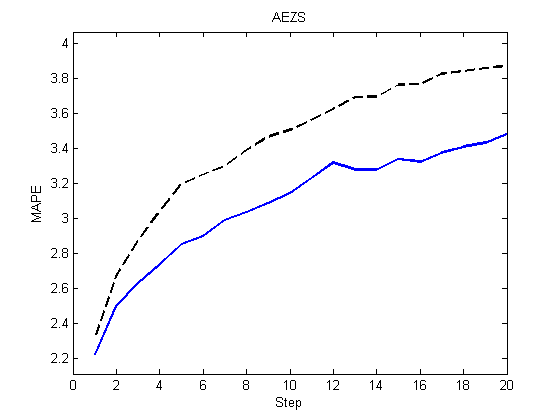

[](http://quantlet.de/)

## [](http://quantlet.de/) **VFARmapePlot** [](http://quantlet.de/)

```yaml

Name of Quantlet : VFARmapePlot

Published in : Unpublished; VFAR

Description : Plot MAPE of VFAR versus Random Walk for multiple step forecasts for AEZS

Keywords : LOB, VFAR, MAPE

See also : VFARbenefitPlot, VFARrandVfarPlot, VFARrandhStepForecastPlot, VFARqqPlot

Author : Ying Chen, Wee Song Chua, Wolfgang Karl Haerdle

Submitted : Sat, Mar 11 2017 by Wee Song Chua

Datafile : AEZSmultiforecast.mat

Example: 
- Plot: MAPE implied by VFAR approach and Random Walk approach for multiple step forecasts

```




### MATLAB Code:
```matlab
%% Plot MAPE of VFAR versus Random Walk for multiple step forecast

% load relevant data
load('AEZSmultiforecast.mat')

% MAPE plot
plot(1:endh,MAPEhorizonVFAR,'b','LineWidth',1.5)
hold on
plot(1:endh,MAPEhorizonNAIVE,'--k','LineWidth',1.5)
hold off
xlim([0 endh])
ylim([lowYlim upYlim])
title(ticker)
ylabel('MAPE')
xlabel('Step')
```
