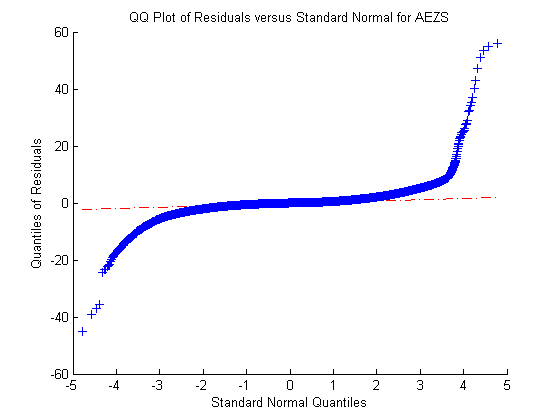

## **VFARqqPlot**

```yaml

Name of Quantlet : VFARqqPlot

Published in : Unpublished; VFAR

Description : 'QQ plot for residuals using VFAR approach for AEZS with LOB data from 
02Jan2015 till 06Mar2015'

Keywords : 'LOB, VFAR, qq plot'

See also : 'VFARcrossCorrPlot, VFARrandVfarPlot, VFARrandhStepForecastPlot
VFARrandBidAskCurvePlot'

Author : Ying Chen, Wee Song Chua, Wolfgang Karl Haerdle

Submitted : Wed, May 18 2016 by Wee Song Chua

Datafile : RES.mat

Example: 
- Plot : "QQ plot for VFAR residuals"

```


