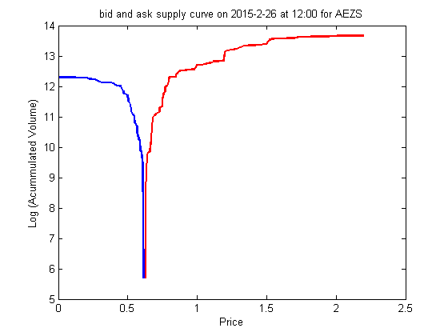

## **VFARrandBidAskCurvePlot**

```yaml

Name of Quantlet : VFARrandBidAskCurvePlot

Published in : Unpublished; VFAR

Description : 'Plot bid ask curve for AEZS at random time point with LOB data from 
02Jan2015 till 06Mar2015'

Keywords : 'LOB, Limit Order Book, plot, time-series, volatility'

See also : 'VFARcrossCorrPlot, VFARrandVfarPlot, VFARrandhStepForecastPlot, VFARqqPlot'

Author : Ying Chen, Wee Song Chua, Wolfgang Karl Haerdle

Submitted : Wed, May 18 2016 by Wee Song Chua

Datafile : AEZS.mat

Example: 
- Plot : "Bid ask curve for AEZS at random time point"

```


