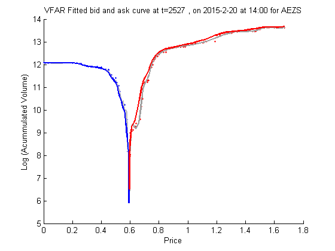

[](http://quantlet.de/)

## [](http://quantlet.de/) **VFARrandVfarPlot** [](http://quantlet.de/)

```yaml

Name of Quantlet : VFARrandVfarPlot

Published in : Unpublished; VFAR

Description : 'Plot estimated bid ask curve using VFAR approach for AEZS with LOB data from
02Jan2015 till 06Mar2015'

Keywords : plot, time-series, volatility, autoregressive, estimation

See also : VFARrandBidAskCurvePlot, VFARcrossCorrPlot, VFARrandhStepForecastPlot, VFARqqPlot

Author : Ying Chen, Wee Song Chua, Wolfgang Karl Haerdle

Submitted : Wed, May 18 2016 by Wee Song Chua

Datafile : AEZS.mat, inSample.mat

Example: 
- Plot: VFAR fitted bid and ask curve for AEZS at random time point

```




### MATLAB Code:
```matlab
%% Plot VFAR in sample estimate fitted bid ask curve at random time
% load relevant data
load('AEZS.mat')
load('inSample.mat')

% total #of 5-mins in our sample
TT    = ( (16*60 - 9.5*60)/5 + 1 - 4)*T;

% #of 5-min in each day
day5  = ( (16*60 - 9.5*60)/5 + 1 - 4); 

% randomly select a time point
ntpt  = randsample(n*T - 1, 1);

% actual time and date
tpt   = ntpt + 1; %actual time point

% Calculate actual date and time
time5 = rem(tpt,day5); % calculate which 5-min in the 75 5-min in a day
if time5==0
    tempmin = 40 + day5*5;
    actDay  = strcat(num2str(Date(floor(tpt/day5),1)),'-',...
              num2str(Date(floor(tpt/day5),2)),'-',...
              num2str(Date(floor(tpt/day5),3)));
else
    tempmin = 40 + time5*5;
    actDay  = strcat(num2str( Date( floor(tpt/day5) + 1, 1) ),'-',...
              num2str( Date( floor(tpt/day5) + 1, 2) ),'-',...
              num2str( Date( floor(tpt/day5) + 1, 3) ) );
end
actHr       = floor(tempmin/60) + 9;
actMin      = sprintf('%.2d', rem(tempmin,60) );
actDayTime  = char(strcat(actDay,' at',{' '}, num2str(actHr), ':' ,...
              num2str(actMin) ) );

% data for bid side
testxB      = bidPrice_CWS{ntpt + 1};
testyB      = bidVol_CWS{ntpt + 1};
testyBhat   = bidVolHat_CWS{ntpt};

% data for ask side
testxA      = askPrice_CWS{ntpt + 1};
testyA      = askVol_CWS{ntpt + 1};
testyAhat   = askVolHat_CWS{ntpt};

% plots
sc1 = scatter(testxB, testyB, 3, 'filled', 'b')
hold on
sc2 = scatter(testxA, testyA, 3, 'filled', 'r')
pl1 = plot(matxb{ntpt + 1}, volHatb{ntpt + 1}, 'color', ...
      [192 192 192]./255, 'LineWidth', 1.5);
pl2 = plot(matxa{ntpt + 1}, volHata{ntpt + 1}, 'color', ...
      [160 160 160]./255, 'LineWidth', 1.5);
pl3 = plot(testxB, testyBhat, 'b', 'LineWidth', 1.5);
pl4 = plot(testxA, testyAhat, 'r', 'LineWidth', 1.5);
hold off
xlabel( 'Price' ) % x-axis label
ylabel( 'Log (Acummulated Volume)' ) % y-axis label
title( char( strcat( 'VFAR Fitted bid and ask curve at t=', ... 
    num2str(ntpt + 1), {' '}, ', on', {' '}, actDayTime, {' '}, 'for', ...
    {' '}, ticker) ) );
```
